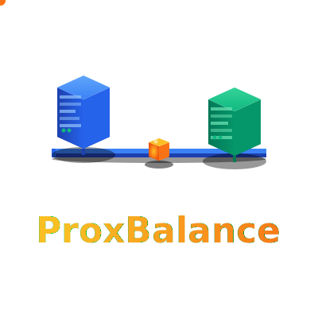
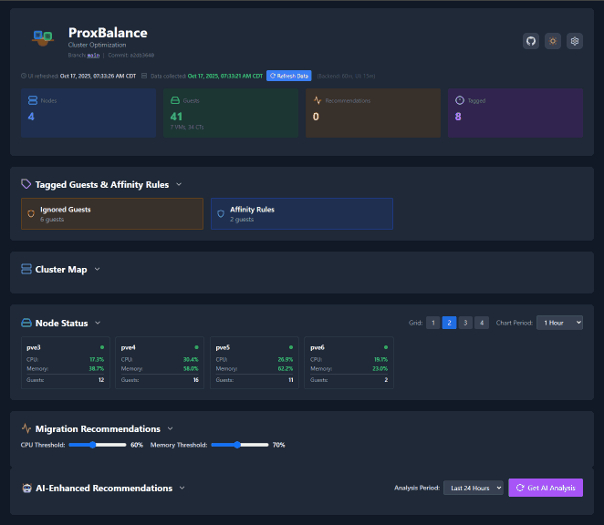
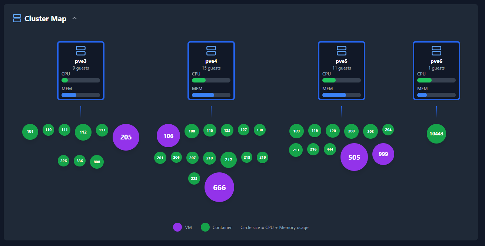
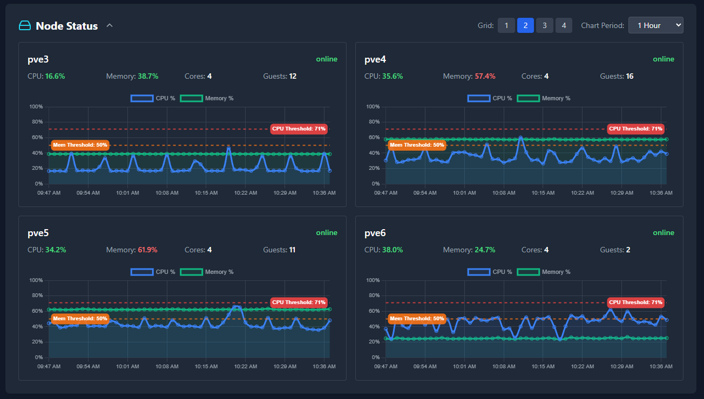
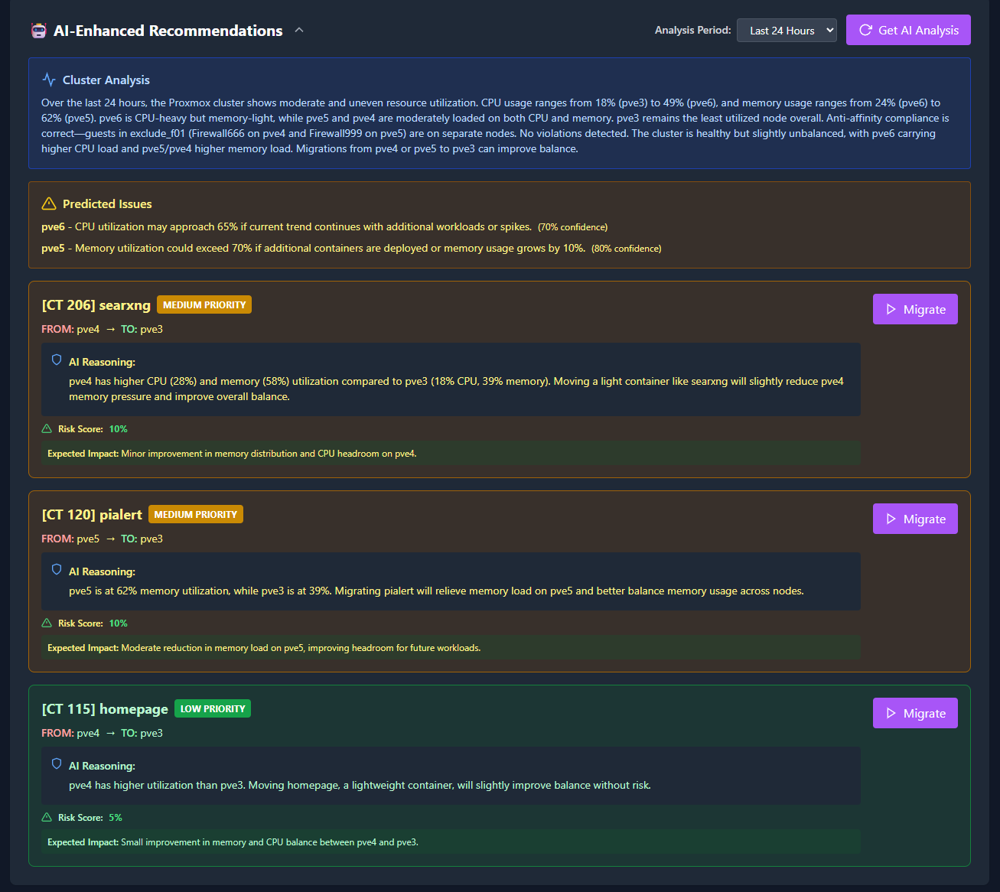

<div align="center">



<br/>
<br/>


[](https://opensource.org/licenses/MIT)
[](https://www.python.org/downloads/)
[](https://www.proxmox.com/)

**Intelligent cluster monitoring and VM/CT migration for Proxmox VE**

[Quick Start](#-quick-start) • [Features](#-features) • [Documentation](docs/README.md)

</div>

---

## 🎯 What is ProxBalance?

ProxBalance is a web-based cluster analyzer and migration manager for Proxmox VE. Monitor your cluster in real-time, get intelligent migration recommendations, and optimize resource distribution across your nodes.

<div align="center">

</div>

---

## 🆕 Recent Updates

### UI Update Enhancement
The UI-triggered update now includes **automatic frontend optimization** with clear progress indicators and full build process integration. One-time Node.js installation and Babel compilation ensure 93% faster page loads for all users.

### Intelligent Penalty-Based Scoring System
ProxBalance features a sophisticated **penalty-based scoring algorithm** with **Suitability Ratings (0-100%)** for intuitive migration decisions. The system evaluates CPU, memory, IOWait, load distribution, storage compatibility, and anti-affinity rules to find optimal migration targets without hard disqualifications.

**Key benefits:**
- 100% = Perfect target, 0% = Poor target (easy to understand)
- IOWait penalties prioritize I/O performance for better VM responsiveness
- Flexible scoring allows evacuating overloaded nodes without restrictions
- Seamlessly integrates with automated migrations

➡️ **[Read the complete Scoring Algorithm Guide](docs/SCORING_ALGORITHM.md)** for detailed explanation, examples, and configuration options.

### Migration & Monitoring Enhancements
- **Real-Time Transfer Speed** - Live MB/s transfer rates during migrations
- **Multi-Disk Progress Tracking** - Accurate progress for VMs with multiple disks
- **Migration History Pagination** - Configurable page size (5-100 entries) with 7-day accurate timeline

### Automation Improvements
- **Automated Recommendations** - Dynamic cluster-aware recommendation generation via systemd timer
- **Infinite Polling with Resource Validation** - Enhanced monitoring prevents conflicts and validates resources
- **Enhanced Concurrency** - Improved tracking of concurrent automated migrations

### UI/UX & Performance
- **Lightning-Fast Page Load** - Pre-compiled JSX architecture reduces LCP from 6.5s to 0.48s (93% faster)
- **Optimized Frontend Build** - Babel CLI pre-compilation eliminates browser transpilation overhead
- **Local React Libraries** - Self-hosted React/React-DOM eliminates CDN latency
- **Enhanced Status Displays** - Better real-time feedback for migrations and automation
- **Optimized Section Layout** - Improved workflow with better UI organization
- **VM Clumping Prevention** - Enhanced load distribution logic
- **Migration Conflict Prevention** - Better detection and prevention of concurrent operations

---

## ✨ Features

### Core Capabilities
- **Real-Time Monitoring** - Live CPU, memory, IOWait, and load metrics with sparkline visualizations
- **Interactive Cluster Map** - Visual representation with 4 view modes (Usage, Allocated, Disk I/O, Network)
- **Smart Recommendations** - Intelligent migration suggestions with Suitability Rating (0-100%)
- **One-Click Migrations** - Execute migrations with real-time progress tracking and transfer speed
- **Node Maintenance Mode** - Mark nodes for maintenance with automatic evacuation
- **Dark Mode** - Modern interface with light/dark theme support
- **Migration History** - 7-day migration timeline with pagination and export capabilities

### Advanced Features
- **AI-Powered Analysis** - Optional AI recommendations using OpenAI, Anthropic, or Ollama
- **Automated Migrations** - Scheduled load balancing with infinite polling and resource validation
- **Automated Recommendations** - Dynamic cluster-aware recommendation generation
- **Anti-Affinity Rules** - Tag-based system to enforce workload separation
- **Storage Compatibility** - Pre-migration validation prevents compatibility errors
- **Multi-Disk Progress Tracking** - Accurate migration progress for VMs with multiple disks
- **IOWait-Aware Scoring** - Node scoring algorithm includes I/O wait penalties

See [Complete Feature List](docs/FEATURES.md) for detailed capabilities.

---

## 🚀 Quick Start

### Installation (5 minutes)

Run this command on your Proxmox host:

```bash
bash -c "$(wget -qLO - https://raw.githubusercontent.com/Pr0zak/ProxBalance/main/install.sh)"
```

The installer will:
1. Auto-detect your cluster nodes
2. Create an unprivileged LXC container
3. Install and configure ProxBalance
4. Create API tokens with proper permissions
5. Start all services

### Access

Once installed, open `http://<container-ip>` in your browser.

---

## 📊 Screenshots

<div align="center">
  <table>
    <tr>
      <td align="center" width="50%">
        
        <br/>
        <b>Dashboard Overview</b>
      </td>
      <td align="center" width="50%">
        
        <br/>
        <b>Interactive Cluster Map</b>
      </td>
    </tr>
    <tr>
      <td align="center" width="50%">
        
        <br/>
        <b>Detailed Node Metrics</b>
      </td>
      <td align="center" width="50%">
        
        <br/>
        <b>AI-Powered Recommendations</b>
      </td>
    </tr>
  </table>
</div>

---

## 📚 Documentation

| Document | Description |
|----------|-------------|
| **[Installation Guide](docs/INSTALL.md)** | Detailed installation and configuration |
| **[Scoring Algorithm](docs/SCORING_ALGORITHM.md)** | How the penalty-based scoring system works |
| **[AI Features](docs/AI_FEATURES.md)** | AI-powered recommendations setup |
| **[Troubleshooting](docs/TROUBLESHOOTING.md)** | Common issues and solutions |
| **[Contributing](docs/CONTRIBUTING.md)** | How to contribute |

➡️ **[Complete Documentation](docs/README.md)**

---

## 🔧 Basic Usage

See [Usage Guide](docs/USAGE.md) for detailed workflows.

---

## 🛠️ System Requirements

- **Proxmox VE**: 7.0 or higher
- **Resources**: 2GB RAM, 2 CPU cores, 8GB disk (minimum)
- **Network**: Connectivity to all cluster nodes
- **Access**: Root access to Proxmox host

---

## 🔒 Security

- API token authentication (no passwords stored)
- Unprivileged LXC container
- Local network design
- Optional SSL/TLS support

---

## 💬 Support

- 🐛 **Bug Reports**: [GitHub Issues](https://github.com/Pr0zak/ProxBalance/issues)
- 💡 **Feature Requests**: [GitHub Discussions](https://github.com/Pr0zak/ProxBalance/discussions)
- 📖 **Documentation**: [docs/README.md](docs/README.md)
- 🔍 **Troubleshooting**: [docs/TROUBLESHOOTING.md](docs/TROUBLESHOOTING.md)

---

## ⭐ Show Your Support

If ProxBalance helps manage your cluster:
- ⭐ Star this repository
- 📢 Share with the homelab community
- 🐛 Report bugs and suggest features

---

## 📄 License

MIT License - see [LICENSE](LICENSE) for details.

---

<div align="center">

**Made with ❤️ for the Proxmox community**

[Documentation](docs/README.md) • [Installation](docs/INSTALL.md) • [GitHub](https://github.com/Pr0zak/ProxBalance)

</div>
