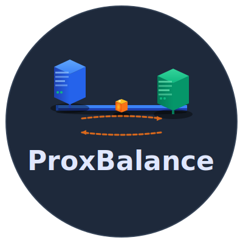
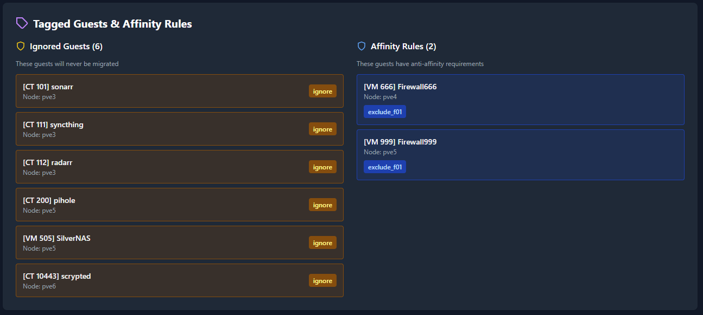

# ProxBalance
<div align="center">



<br/>
<br/>


[](https://opensource.org/licenses/MIT)
[](https://www.python.org/downloads/)
[](https://www.proxmox.com/)

**Automated cluster load balancing and intelligent VM/CT migration for Proxmox VE**

[Quick Start](#quick-start) • [Features](#features) • [Documentation](docs/README.md) • [AI Features](docs/AI_FEATURES.md) • [Troubleshooting](docs/TROUBLESHOOTING.md)

---

### 🎯 Install in One Command

```bash
bash -c "$(wget -qLO - https://raw.githubusercontent.com/Pr0zak/ProxBalance/main/install.sh)"
```

**⏱️ Complete setup in under 5 minutes!**  
Run on a Proxmox host, creates an LXC container with ProxBalance installed.

➡️ **[Detailed Installation Guide](docs/INSTALL.md#-quick-install-recommended)**

---

</div>

---

## 🎯 Overview

ProxBalance is a comprehensive web-based cluster balance analyzer and automated migration manager for Proxmox VE. It continuously monitors your cluster's resource utilization and provides intelligent migration recommendations to keep your infrastructure balanced and efficient.

### Why ProxBalance?

- **Real-time Monitoring** - Track CPU, memory, and load across all nodes
- **Smart Recommendations** - Migration suggestions based on historical data
- **AI-Powered Analysis** (v2.0) - Optional AI recommendations using GPT-4, Claude, or local LLMs
- **Anti-Affinity Rules** - Tag-based system to enforce workload separation
- **One-Click Migrations** - Execute individual or batch migrations from the web UI
- **Zero Downtime** - Online migration for VMs, restart migration for containers
- **Dark Mode** - Beautiful, modern interface with light/dark themes
- **Enhanced Installer** (v2.0) - Beautiful visual interface with progress tracking

---

## ✨ Features

### 📊 Cluster Monitoring
- **Real-time metrics** for CPU, memory, and system load across all nodes
- **Historical analysis** using Proxmox RRD data (1-hour timeframe) for trend-based decisions
- **Automatic discovery** of all VMs (qemu) and containers (lxc) across the cluster
- **Health indicators** with customizable threshold alerts
- **Cached data architecture** - Fast API responses using JSON cache with atomic writes
- **Background collection** - Data gathered via systemd timer without blocking UI

### 🤖 Intelligent Balancing
- **Smart migration recommendations** based on node load and resource availability
  - Uses historical averages when available, falls back to current metrics
  - Considers both CPU and memory thresholds
  - Selects smallest guests first for efficient rebalancing
- **AI-Powered Analysis** (Optional) - Advanced migration recommendations
  - **Multiple AI Provider Support**: OpenAI (GPT-4), Anthropic (Claude), Local LLM (Ollama)
  - **Configurable Time Periods**: Analyze cluster trends over 1 hour, 6 hours, 24 hours, or 7 days
  - **Context-Aware Recommendations**: AI analyzes historical patterns, node capabilities, and workload characteristics
  - **Smart Filtering**: Prevents hallucinated recommendations and self-migrations
  - **Detailed Reasoning**: Each AI recommendation includes explanation of why it was suggested
- **Anti-affinity enforcement** to prevent conflicting workloads on same nodes
  - Validates exclusion groups before suggesting migrations
  - Prevents migrations that would violate affinity rules
- **Ignore tags** to protect critical VMs from automatic migration
- **Batch migration** support with async execution for cluster-wide rebalancing
  - Non-blocking migrations run in background
  - Individual migration status tracking

### 🎨 Modern Web Interface
- **React-based dashboard** with real-time updates
- **Dark/light mode** support
- **Responsive design** for desktop and mobile
- **Configurable refresh intervals** for backend collection and UI updates
- **Live migration status** tracking with progress indicators

### 🔧 Advanced Configuration
- **Tag-based rules** for fine-grained control
  - `ignore` - Exclude from automatic migrations
  - `exclude_<group>` - Anti-affinity groups (prevents guests with same tag from being on same node)
- **Customizable thresholds** for CPU (40-90%) and memory (50-95%)
- **Flexible scheduling** with adjustable collection intervals (5-240 minutes)
- **API-based architecture** using Proxmox API tokens for secure, fast communication
- **Automatic configuration validation** with detailed error messages
- **Dynamic timer updates** - collection intervals update systemd timer in real-time

---

## 🚀 Quick Start

### Prerequisites

- Proxmox VE 7.0 or higher
- Root access to Proxmox host
- Network connectivity between container and all nodes
- Minimum: 2GB RAM, 2 CPU cores, 8GB disk
- Recommended: 4GB RAM, 2 CPU cores, 16GB disk

### Installation

#### Automated Install (Recommended)

```bash
# On your Proxmox host, run:
bash -c "$(wget -qLO - https://raw.githubusercontent.com/Pr0zak/ProxBalance/main/install.sh)"
```

**The enhanced installer v2.0** features:
- 🎨 **Beautiful visual interface** with colors, animations, and progress indicators
- ⚡ **Real-time progress tracking** with spinning status icons
- 📊 **Detailed installation steps** showing exactly what's happening
- ✅ **Smart validation** with comprehensive error checking

The installer will:
1. **Auto-detect your cluster nodes** using multiple methods (corosync.conf, /etc/pve/nodes/, pvecm, pvesh)
2. **Create an unprivileged LXC container** (default ID: next available, auto-incremented)
3. **Configure networking** - DHCP (auto-detected) or static IP
4. **Install all dependencies** - Python 3.8+, Flask, Gunicorn, Nginx, jq, curl, git (with detailed progress)
5. **Setup API authentication** - Create Proxmox API token with appropriate permissions
6. **Deploy and start all services** - API, collector timer, and web server
7. **Wait for initial data collection** - Monitors collection progress with animations (up to 3 attempts, 60s each)
8. **Verify installation** - Tests API connectivity and service status

#### Manual Install

See [docs/INSTALL.md](docs/INSTALL.md) for detailed step-by-step instructions.

### Initial Configuration

The installer automatically configures most settings, but you should verify:

1. **Access the web interface**: `http://<container-ip>`
   - The installer displays the URL at completion

2. **Wait for initial data collection** (2-5 minutes)
   - First collection runs automatically
   - View progress: `pct exec <ctid> -- journalctl -u proxmox-collector -f`

3. **Verify cluster detection**
   - Check that all nodes appear in the dashboard
   - Verify API connectivity is working

4. **Adjust settings** (optional)
   - Click ⚙️ Settings icon (positioned at top-right corner)
   - Customize collection intervals (default: 60 min)
   - Customize UI refresh intervals (default: 15 min)
   - Enable AI-powered migration recommendations (optional)
   - Configure AI provider (OpenAI, Anthropic, or Ollama)
   - Select analysis time period (1h, 6h, 24h, or 7d)

### Upgrading from v1.x to v2.0

If you have an existing ProxBalance v1.x installation, you can upgrade to v2.0:

```bash
bash -c "$(wget -qLO - https://raw.githubusercontent.com/Pr0zak/ProxBalance/main/upgrade-to-v2.sh)" _ <container-id>
```

The upgrade script will:
- Backup your current configuration
- Update code to v2.0
- Install new dependencies
- Update systemd services
- Preserve your existing settings

**Note:** v2.0 requires Proxmox API tokens. After upgrading, you'll need to configure API access. See [Installation Guide](docs/INSTALL.md) for details.

### Quick Health Check

Run the status checker script:

```bash
bash -c "$(wget -qLO - https://raw.githubusercontent.com/Pr0zak/ProxBalance/main/check-status.sh)" _ <container-id>
```

This provides a comprehensive health report including:
- Container status
- Service status (API, collector timer, web server)
- Cache age and content
- API health checks
- Proxmox API token validation and connectivity test

---

## 📚 Documentation

### Complete Documentation Index

**➡️ [Documentation Home](docs/README.md)** - Complete documentation index with table of contents

### Quick Links

| Document | Description |
|----------|-------------|
| **[Installation Guide](docs/INSTALL.md)** | Complete installation instructions, AI setup, security hardening |
| **[Troubleshooting](docs/TROUBLESHOOTING.md)** | Solutions to common issues, diagnostic commands |
| **[AI Features](docs/AI_FEATURES.md)** | AI-powered recommendations setup and usage |
| **[AI Quick Setup](docs/AI_INSTALL.md)** | Fast configuration for OpenAI, Anthropic, Ollama |
| **[Contributing](docs/CONTRIBUTING.md)** | How to contribute to ProxBalance |
| **[Docker Dev](docs/DOCKER_DEV.md)** | Local development environment setup |

### Topics

- **Getting Started**: [Quick Start](#quick-start) • [Installation](docs/INSTALL.md) • [Configuration](#configuration)
- **Features**: [Cluster Monitoring](#cluster-monitoring) • [Intelligent Balancing](#intelligent-balancing) • [AI Features](docs/AI_FEATURES.md)
- **Usage**: [Tagging Guests](#tagging-guests) • [API Endpoints](#api-endpoints) • [Usage Guide](#usage)
- **Help**: [Troubleshooting](docs/TROUBLESHOOTING.md) • [GitHub Issues](https://github.com/Pr0zak/ProxBalance/issues) • [Discussions](https://github.com/Pr0zak/ProxBalance/discussions)

---

## ⚙️ Configuration

### Configuration File

Location: `/opt/proxmox-balance-manager/config.json`

```json
{
  "collection_interval_minutes": 60,
  "ui_refresh_interval_minutes": 15,
  "proxmox_host": "10.0.0.3",
  "proxmox_port": 8006,
  "proxmox_api_token_id": "root@pam!proxbalance",
  "proxmox_api_token_secret": "xxxxxxxx-xxxx-xxxx-xxxx-xxxxxxxxxxxx",
  "ai_provider": "openai",
  "ai_api_key": "sk-...",
  "ai_model": "gpt-4",
  "ai_analysis_period": "24h"
}
```

### Core Configuration Options

| Option | Description | Default | Range |
|--------|-------------|---------|-------|
| `collection_interval_minutes` | How often to collect cluster data | 60 | 5-240 |
| `ui_refresh_interval_minutes` | How often the UI auto-refreshes | 15 | 5-120 |
| `proxmox_host` | Primary Proxmox host IP | Auto-detected | Any valid IP/hostname |
| `proxmox_port` | Proxmox API port | 8006 | Any valid port |
| `proxmox_api_token_id` | API token ID (format: user@realm!tokenname) | Set by installer | - |
| `proxmox_api_token_secret` | API token secret | Set by installer | - |

**Note:** Set UI interval ≤ backend interval for best experience.

### AI Provider Configuration (Optional)

ProxBalance supports optional AI-powered migration recommendations through multiple providers:

#### Supported AI Providers

| Provider | Description | API Key Required | Cost |
|----------|-------------|------------------|------|
| **OpenAI** | GPT-4/GPT-3.5 models | Yes | Pay-per-use |
| **Anthropic** | Claude 3.5 Sonnet/Haiku | Yes | Pay-per-use |
| **Ollama** | Local LLM (self-hosted) | No | Free |

#### AI Configuration Options

| Option | Description | Default | Options |
|--------|-------------|---------|---------|
| `ai_enabled` | Enable AI recommendations | false | true/false |
| `ai_provider` | AI provider to use | openai | openai, anthropic, ollama |
| `ai_api_key` | API key (OpenAI/Anthropic) | - | Your API key |
| `ai_model` | Model name | gpt-4 | See provider docs |
| `ai_base_url` | Ollama base URL | http://localhost:11434 | Any valid URL |
| `ai_analysis_period` | Historical data timeframe | 24h | 1h, 6h, 24h, 7d |

#### Configuring AI via Web Interface

1. Click ⚙️ Settings icon (top-right)
2. Scroll to "AI-Enhanced Migration Recommendations"
3. Toggle "Enable AI Recommendations"
4. Select your AI provider from dropdown
5. Enter required credentials:
   - **OpenAI**: Enter API key (from https://platform.openai.com/api-keys)
   - **Anthropic**: Enter API key (from https://console.anthropic.com/settings/keys)
   - **Ollama**: Enter base URL (default: http://localhost:11434)
6. Select analysis time period (1 hour, 6 hours, 24 hours, or 7 days)
7. Click "Save Settings"

#### Setting Up Ollama (Local LLM)

For self-hosted AI recommendations without API costs:

```bash
# Install Ollama on a server with GPU (recommended) or CPU
curl -fsSL https://ollama.com/install.sh | sh

# Pull a recommended model (adjust based on your hardware)
ollama pull llama3.1:8b  # Smaller, faster (8GB RAM)
ollama pull llama3.1:70b # Larger, more accurate (48GB+ RAM)

# In ProxBalance settings:
# - AI Provider: Ollama
# - Base URL: http://<ollama-server-ip>:11434
# - Model: llama3.1:8b (or your chosen model)
```

**Benefits of AI Recommendations:**
- Analyzes historical trends over configurable time periods
- Considers workload patterns and node capabilities
- Provides detailed reasoning for each recommendation
- Helps prevent migrations during peak usage times
- Identifies optimal target nodes based on resource trends

### Updating Configuration

#### Via Web Interface
1. Click ⚙️ Settings icon
2. Adjust intervals using sliders
3. Click "Save Settings"
4. Services restart automatically

#### Via Command Line

```bash
# View current settings
pct exec <ctid> -- /opt/proxmox-balance-manager/manage_settings.sh show

# Set backend collection interval
pct exec <ctid> -- /opt/proxmox-balance-manager/manage_settings.sh set-backend 30

# Set UI refresh interval
pct exec <ctid> -- /opt/proxmox-balance-manager/manage_settings.sh set-ui 15

# Set both intervals at once
pct exec <ctid> -- /opt/proxmox-balance-manager/manage_settings.sh set-both 45
```

---

## 📖 Usage

### Tagging Guests

**Ignore tag** - Prevent automatic migration:
```bash
pvesh set /nodes/<node-name>/qemu/<vmid>/config --tags "ignore"
```

**Anti-affinity tags** - Keep workloads separated:
```bash
# Example: Firewall VMs that must be on different nodes
pvesh set /nodes/<node1>/qemu/<vmid1>/config --tags "exclude_firewall"
pvesh set /nodes/<node2>/qemu/<vmid2>/config --tags "exclude_firewall"

# Example: Database servers with anti-affinity
pvesh set /nodes/<node1>/qemu/<vmid1>/config --tags "exclude_database"
pvesh set /nodes/<node2>/qemu/<vmid2>/config --tags "exclude_database"
```

**Multiple tags** - Combine ignore with anti-affinity:
```bash
pvesh set /nodes/<node>/qemu/<vmid>/config --tags "ignore;exclude_firewall"
```

### API Endpoints

```bash
# Health check
curl http://<container-ip>/api/health

# Get cluster analysis
curl http://<container-ip>/api/analyze

# Get migration recommendations (traditional)
curl -X POST http://<container-ip>/api/recommendations \
  -H "Content-Type: application/json" \
  -d '{"cpu_threshold": 60, "mem_threshold": 70}'

# Get AI-powered recommendations (v2.0)
curl -X POST http://<container-ip>/api/ai-recommendations \
  -H "Content-Type: application/json" \
  -d '{"cpu_threshold": 60, "mem_threshold": 70}'

# Trigger data refresh
curl -X POST http://<container-ip>/api/refresh

# Execute single migration
curl -X POST http://<container-ip>/api/migrate \
  -H "Content-Type: application/json" \
  -d '{
    "vmid": 100,
    "source_node": "pve1",
    "target_node": "pve2",
    "type": "VM"
  }'

# Execute batch migrations
curl -X POST http://<container-ip>/api/migrate/batch \
  -H "Content-Type: application/json" \
  -d '{
    "migrations": [
      {"vmid": 100, "source_node": "pve1", "target_node": "pve2", "type": "VM"},
      {"vmid": 101, "source_node": "pve1", "target_node": "pve3", "type": "CT"}
    ]
  }'

# Get configuration
curl http://<container-ip>/api/config

# Update configuration
curl -X POST http://<container-ip>/api/config \
  -H "Content-Type: application/json" \
  -d '{
    "collection_interval_minutes": 30,
    "ui_refresh_interval_minutes": 15,
    "ai_enabled": true,
    "ai_provider": "anthropic",
    "ai_api_key": "sk-ant-...",
    "ai_model": "claude-3-5-sonnet-20241022",
    "ai_analysis_period": "24h"
  }'
```

### Useful Commands

```bash
# Check all service status
pct exec <ctid> -- systemctl status proxmox-balance proxmox-collector.timer nginx

# View API logs
pct exec <ctid> -- journalctl -u proxmox-balance -f

# View collector logs
pct exec <ctid> -- journalctl -u proxmox-collector -f

# Check cache file
pct exec <ctid> -- jq '.' /opt/proxmox-balance-manager/cluster_cache.json | head -50

# Manually trigger collection
pct exec <ctid> -- systemctl start proxmox-collector.service

# Restart all services
pct exec <ctid> -- systemctl restart proxmox-balance proxmox-collector.timer nginx

# Trigger manual data collection
pct exec <ctid> -- systemctl start proxmox-collector.service
```
---

## 📸 Screenshots

### Main Dashboard

*Main dashboard showing cluster status, resource metrics, and migration recommendations*

### Node Status & Resource Monitoring

*Real-time view of all cluster nodes with CPU, memory, cores, and guest distribution*

### Migration Recommendations

*Intelligent migration suggestions with detailed reasoning and one-click execution*

### Tagged Guests & Affinity Rules

*Visual management of ignored guests and anti-affinity groups for workload separation*

### Settings Configuration

*Easy configuration of collection intervals, UI refresh rates, and thresholds*

---

## 🏗️ Architecture

```
┌─────────────────────────────────────────────────────┐
│                   Web Browser                       │
│              http://<container-ip>                  │
└────────────────────┬────────────────────────────────┘
                     │
                     ▼
┌─────────────────────────────────────────────────────┐
│                    Nginx                            │
│         (Static files + API proxy)                  │
└────────────────────┬────────────────────────────────┘
                     │
                     ▼
┌─────────────────────────────────────────────────────┐
│              Flask API (Gunicorn)                   │
│         Port 5000 - REST endpoints                  │
│              + AI Provider Layer                    │
└─────┬───────────────────────────────────────────┬───┘
      │                                           │
      │  ┌────────────────────────────────────┐  │
      │  │  AI Providers (Optional)           │  │
      │  │  - OpenAI (GPT-4)                  │  │
      │  │  - Anthropic (Claude)              │  │
      │  │  - Ollama (Local LLM)              │  │
      │  └────────────────────────────────────┘  │
      │                                           │
      ▼                                           ▼
┌─────────────────────────────────────────────────────┐
│          cluster_cache.json (Cache)                 │
│         (Read by API, written by collector)         │
└────────────────────┬────────────────────────────────┘
                     │
                     ▼
┌─────────────────────────────────────────────────────┐
│       Background Collector (systemd timer)          │
│    Runs every N minutes, collects via API           │
└────────────────────┬────────────────────────────────┘
                     │
                     ▼
┌─────────────────────────────────────────────────────┐
│       Proxmox Cluster (API w/ Token Auth)           │
│        Proxmox API calls via proxmoxer library      │
└─────────────────────────────────────────────────────┘
```

### Components

- **Frontend**: React with Tailwind CSS (single-page application in index.html)
- **Backend API**: Flask + Gunicorn (Python 3.8+) on port 5000
- **AI Provider Layer**: ai_provider.py - Abstraction for OpenAI, Anthropic, and Ollama (optional)
- **Web Server**: Nginx (reverse proxy + static files) on port 80
- **Data Collector**: Python script (collector_api.py) with systemd timer
- **Cache**: JSON file (cluster_cache.json) with atomic writes for fast API responses
- **Communication**: Proxmox API with token-based authentication via proxmoxer library
- **Configuration Manager**: update_timer.py dynamically updates systemd timers
- **Settings CLI**: manage_settings.sh for command-line configuration management

---

## 📁 Project Structure

```
ProxBalance/
├── app.py                      # Flask API server (REST endpoints)
├── ai_provider.py              # AI provider abstraction (OpenAI, Anthropic, Ollama)
├── collector_api.py            # Background data collector with RRD analysis (API-based)
├── index.html                  # React web interface (single-page app)
├── config.json                 # Runtime configuration file
├── config.example.json         # Example configuration template
├── manage_settings.sh          # Settings CLI tool
├── update_timer.py             # Dynamic systemd timer updater
├── install.sh                  # Automated installer v2.0 with visual enhancements
├── check-status.sh             # Comprehensive status checker script
├── debug-services.sh           # Service debugger tool
├── create_api_token.sh         # Helper script to create Proxmox API tokens
├── test_api_token.sh           # Test API token connectivity
├── post_update.sh              # Post-update script for upgrades
├── systemd/
│   ├── proxmox-balance.service       # Flask API systemd service
│   ├── proxmox-collector.service     # Data collector service
│   └── proxmox-collector.timer       # Dynamic collection timer
├── nginx/
│   └── proxmox-balance               # Nginx reverse proxy config
├── docs/
│   ├── README.md                     # Documentation index and table of contents
│   ├── INSTALL.md                    # Detailed installation guide
│   ├── TROUBLESHOOTING.md            # Comprehensive troubleshooting guide
│   ├── AI_FEATURES.md                # AI recommendations documentation
│   ├── AI_INSTALL.md                 # Quick AI setup guide
│   ├── CONTRIBUTING.md               # Contribution guidelines
│   ├── DOCKER_DEV.md                 # Docker development environment
│   └── images/                       # Screenshots and documentation images
├── assets/
│   ├── logo.svg                      # ProxBalance logo
│   └── favicon.svg                   # Browser favicon
├── LICENSE                     # MIT License
└── README.md                   # This file (you are here)
```

---

## 🔒 Security

ProxBalance uses Proxmox API tokens for authentication:

- **No passwords stored** - All authentication via API tokens
- **Token-based auth** - Separate token secret, not shared with user password
- **Unprivileged container** - Runs as unprivileged LXC
- **Local network only** - Designed for internal cluster networks
- **API on localhost** - Nginx proxies, no direct external access to Flask

### Security Best Practices

1. **Use unprivileged LXC container** (default in installer)
2. **Implement firewall rules** to restrict web interface access
3. **Consider SSL/TLS** with Let's Encrypt if exposing externally
4. **Regular audits** - Review migration logs for unexpected activity
5. **API token rotation** - Periodically regenerate API tokens
6. **Network isolation** - Run on management VLAN if possible

### Optional Security Hardening

```bash
# Firewall rules (UFW)
pct exec <ctid> -- apt-get install -y ufw
pct exec <ctid> -- ufw allow from <your-network>/24 to any port 80
pct exec <ctid> -- ufw enable

# SSL/TLS with Let's Encrypt
pct exec <ctid> -- apt-get install -y certbot python3-certbot-nginx
pct exec <ctid> -- certbot --nginx -d your-domain.com
```

---

## 🛠️ Troubleshooting

### Quick Diagnostics

```bash
# Run comprehensive status check
bash -c "$(wget -qLO - https://raw.githubusercontent.com/Pr0zak/ProxBalance/main/check-status.sh)" _ <ctid>

# Debug service issues
bash -c "$(wget -qLO - https://raw.githubusercontent.com/Pr0zak/ProxBalance/main/debug-services.sh)" _ <ctid>
```

### Common Issues

#### No cached data available

```bash
# Trigger manual collection
pct exec <ctid> -- systemctl start proxmox-collector.service

# Watch collection progress
pct exec <ctid> -- journalctl -u proxmox-collector -f

# Check if cache file exists
pct exec <ctid> -- ls -lh /opt/proxmox-balance-manager/cluster_cache.json
```

#### API not responding (502 Bad Gateway)

```bash
# Check Flask service
pct exec <ctid> -- systemctl status proxmox-balance

# Restart Flask
pct exec <ctid> -- systemctl restart proxmox-balance

# View recent logs
pct exec <ctid> -- journalctl -u proxmox-balance -n 50
```

#### API connectivity issues

```bash
# Check API token configuration
pct exec <ctid> -- cat /opt/proxmox-balance-manager/config.json | jq '.proxmox_api_token_id, .proxmox_api_token_secret'

# Test API connection from container
pct exec <ctid> -- python3 -c "from proxmoxer import ProxmoxAPI; print('API test successful')"

# View collector logs for API errors
pct exec <ctid> -- journalctl -u proxmox-collector -n 50
```

#### Migrations failing

```bash
# Check migration logs in container
pct exec <ctid> -- journalctl -u proxmox-balance -n 50 | grep migrate

# Verify API token has migration permissions
# Token needs Administrator or VM.Allocate + VM.Migrate privileges

# Check cluster task log via web UI
# Proxmox UI -> Datacenter -> Tasks
```

See [docs/TROUBLESHOOTING.md](docs/TROUBLESHOOTING.md) for detailed solutions and comprehensive troubleshooting guides.

---

## 📊 Performance Recommendations

### Cluster Size Guidelines

| Cluster Size | Backend Interval | UI Interval | Expected RAM Usage |
|--------------|------------------|-------------|--------------------|
| 1-20 guests  | 15-30 min        | 10-15 min   | ~200MB            |
| 21-50 guests | 30-60 min        | 15-30 min   | ~250MB            |
| 51-100 guests| 60-120 min       | 30-60 min   | ~300MB            |
| 100+ guests  | 120-240 min      | 60-120 min  | ~400MB            |

### Resource Usage

- **Container Idle**: ~200MB RAM, <5% CPU
- **During Collection**: ~50-100MB RAM spike, 10-20% CPU for 30-60 seconds
- **Network**: Minimal (API queries only, ~100KB per collection)
- **Storage**: <100MB total, cache file grows with cluster size

### Optimization Tips

1. **Large clusters** (100+ guests): Increase intervals to reduce overhead
2. **Real-time monitoring**: Use shorter intervals for critical clusters
3. **Resource-constrained hosts**: Increase intervals, allocate more RAM to container
4. **Multiple networks**: Ensure low-latency connection between container and all nodes

---

## 📝 Version History

### Latest Version: 2.0.0 (January 2025) - AI-Powered & Enhanced Installer

**🤖 AI-Powered Migration Recommendations (New):**
- Multiple AI provider support: OpenAI (GPT-4), Anthropic (Claude), Ollama (local LLM)
- Configurable analysis time periods: 1h, 6h, 24h, 7d
- Context-aware recommendations analyzing historical trends and workload patterns
- Smart filtering to prevent hallucinated nodes and self-migrations
- Detailed reasoning explanations for each AI recommendation
- Cost-effective local LLM option via Ollama

**🎨 Enhanced Installer v2.0 (New):**
- Beautiful visual interface with colors, animations, and ASCII art
- Real-time progress tracking with spinning status indicators (braille characters)
- Detailed dependency installation progress (package lists, Python, Nginx, utilities)
- Smart initial data collection with progress monitoring (3 retry attempts, 60s timeout)
- Enhanced error messages and validation
- Improved user prompts with better formatting

**🔧 Core Features:**
- Real-time cluster monitoring with configurable historical RRD data analysis (1h-7d timeframes)
- Intelligent migration recommendations using averages when available
- Tag-based anti-affinity rules (`ignore`, `exclude_<group>`)
- Batch migration support with async, non-blocking execution
- Configurable collection intervals (5-240 minutes) with dynamic systemd timer updates
- Modern React-based web UI with dark/light mode support

**🖥️ UI Improvements:**
- Larger, more prominent ProxBalance logo (96px) in dashboard header
- GitHub icon and link integration (https://github.com/Pr0zak/ProxBalance)
- Settings icon repositioned to top-right corner
- Improved grid layout options for node status (1-4 column layouts)
- Collapsible sections for Node Status and Tagged Guests (collapsed by default)
- Mini status view when sections collapsed
- CPU/Memory threshold sliders integrated into node charts
- Enhanced chart rendering with period selectors

**🔐 Authentication & API:**
- Proxmox API token-only authentication (SSH removed)
- Enhanced API token permissions with clear documentation
- 8 REST API endpoints including AI recommendations endpoint
- Flask + Gunicorn WSGI server on port 5000
- Nginx reverse proxy on port 80
- Cached data architecture with atomic JSON writes
- Configuration validation with detailed error messages

**📦 Installation & Deployment:**
- Automated installer v2.0 with enhanced visual design
- Multi-method cluster node auto-detection (corosync, pvesh, pvecm)
- Proxmox API token setup with automatic token creation
- Bootstrap installer for one-command deployment
- Unprivileged LXC container deployment
- Automatic IP detection (DHCP) with static IP option

**🛠️ Administration Tools:**
- Enhanced status checker (check-status.sh) with API-only focus
- Service debugger (debug-services.sh)
- Settings management CLI (manage_settings.sh)
- Web-based settings configuration with auto-restart
- AI provider configuration via web interface

**🔒 Security:**
- API token-based authentication only (no SSH)
- Unprivileged container architecture
- No stored passwords or credentials
- Local network design
- Optional SSL/TLS support

---

### Version 1.1.0 (January 2025) - Initial Release

**Core Features:**
- Real-time cluster monitoring with historical RRD data analysis
- Intelligent migration recommendations
- Tag-based anti-affinity rules
- Batch migration support
- Modern web UI with dark/light mode

**Installation:**
- Automated installer v1.1
- API token authentication
- Unprivileged LXC deployment

---

## 💬 Community & Support

### 🐛 Found a Bug?
Open an [issue](https://github.com/Pr0zak/ProxBalance/issues) with:
- Your Proxmox VE version
- Container configuration (`pct config <ctid>`)
- Steps to reproduce
- Logs from status checker script

### 💡 Feature Request?
We'd love to hear your ideas! Open a [feature request](https://github.com/Pr0zak/ProxBalance/issues/new) or start a [discussion](https://github.com/Pr0zak/ProxBalance/discussions).

### 🤝 Want to Contribute?
Contributions are welcome! See our [CONTRIBUTING.md](docs/CONTRIBUTING.md) guide.

### 📣 Share Your Experience
Using ProxBalance? Share your setup:
- [r/Proxmox](https://reddit.com/r/Proxmox)
- [r/homelab](https://reddit.com/r/homelab)
- [Proxmox Forums](https://forum.proxmox.com/)

---

## ⭐ Show Your Support

If ProxBalance helps you manage your Proxmox cluster:
- ⭐ **Star this repository** on GitHub
- 📢 **Share it** with the homelab community
- 🐛 **Report bugs** to help improve
- 💡 **Suggest features** you'd like to see
- 🤝 **Contribute** code or documentation

---

## 📄 License

This project is licensed under the MIT License - see the [LICENSE](LICENSE) file for details.

---

## 🙏 Acknowledgments

- **Proxmox VE** - Excellent open-source virtualization platform
- **React** - UI framework
- **Flask** - Python web framework
- **Tailwind CSS** - Utility-first CSS framework
- **Community Contributors** - Thank you for testing, feedback, and improvements!

---

<div align="center">

**Made with ❤️ for the Proxmox community**

[⬆ Back to Top](#proxbalance)

</div>
