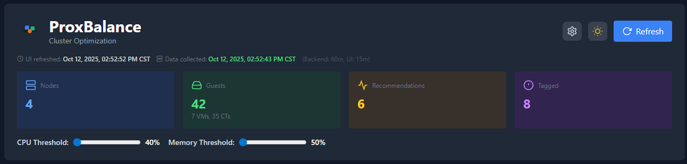
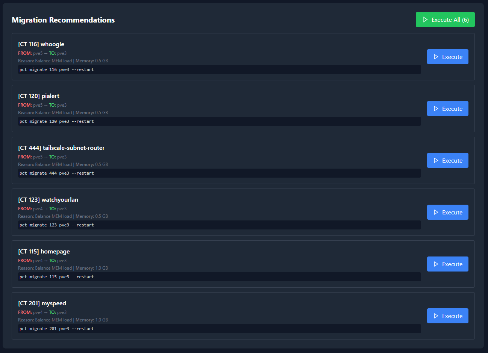
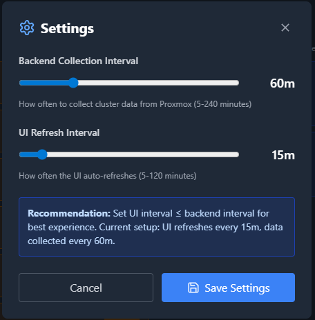

# ProxBalance

<div align="center">


[](https://opensource.org/licenses/MIT)
[](https://www.python.org/downloads/)
[](https://www.proxmox.com/)

**Automated cluster load balancing and intelligent VM/CT migration for Proxmox VE**

[Features](#-features) • [Installation](#-installation) • [Usage](#-usage) • [Screenshots](#-screenshots) • [Documentation](#-documentation)

</div>

---

## 🎯 Overview

ProxBalance is a comprehensive web-based cluster balance analyzer and automated migration manager for Proxmox VE. It continuously monitors your cluster's resource utilization and provides intelligent migration recommendations to keep your infrastructure balanced and efficient.

### Why ProxBalance?

- **Real-time Monitoring** - Track CPU, memory, and load across all nodes
- **Smart Recommendations** - AI-powered migration suggestions based on historical data
- **Anti-Affinity Rules** - Tag-based system to enforce workload separation
- **One-Click Migrations** - Execute individual or batch migrations from the web UI
- **Zero Downtime** - Online migration for VMs, restart migration for containers
- **Dark Mode** - Beautiful, modern interface with light/dark themes

---

## ✨ Features

### 📊 Cluster Monitoring
- **Real-time metrics** for CPU, memory, and system load across all nodes
- **Historical analysis** using Proxmox RRD data for trend-based decisions
- **Automatic discovery** of all VMs and containers across the cluster
- **Health indicators** with customizable threshold alerts

### 🤖 Intelligent Balancing
- **Smart migration recommendations** based on node load and resource availability
- **Anti-affinity enforcement** to prevent conflicting workloads on same nodes
- **Ignore tags** to protect critical VMs from automatic migration
- **Batch migration** support for cluster-wide rebalancing

### 🎨 Modern Web Interface
- **React-based dashboard** with real-time updates
- **Dark/light mode** support
- **Responsive design** for desktop and mobile
- **Configurable refresh intervals** for backend collection and UI updates
- **Live migration status** tracking with progress indicators

### 🔧 Advanced Configuration
- **Tag-based rules** for fine-grained control
  - `ignore` - Exclude from automatic migrations
  - `exclude_<group>` - Anti-affinity groups
- **Customizable thresholds** for CPU and memory
- **Flexible scheduling** with adjustable collection intervals (5-240 minutes)
- **SSH-based architecture** for secure, direct Proxmox control

---

## 🚀 Quick Start

### Prerequisites

- Proxmox VE 7.0 or higher
- Debian 11/12 LXC container (unprivileged)
- SSH access to all Proxmox nodes
- Python 3.8+
- 2GB RAM, 2 CPU cores, 8GB disk (minimum)

### Installation

#### Option 1: Automated Install (Recommended)

```bash
# On your Proxmox host, download and run the installer
wget https://raw.githubusercontent.com/zak-forsyth/ProxBalance/main/install.sh
chmod +x install.sh
./install.sh
```

#### Option 2: Manual Install

See [INSTALL.md](INSTALL.md) for detailed step-by-step instructions.

### Quick Configuration

1. **Update config.json** with your Proxmox host IP:
   ```bash
   pct exec <container-id> -- nano /opt/proxmox-balance-manager/config.json
   # Change "CHANGE_ME" to your Proxmox host IP
   ```

2. Access the web interface: `http://<container-ip>`

3. Click the ⚙️ Settings icon to adjust collection and refresh intervals

4. Start monitoring your cluster!

---

## ⚙️ Configuration

### Initial Setup

After installation, you must configure the Proxmox host IP:

1. Edit the configuration file:
   ```bash
   nano /opt/proxmox-balance-manager/config.json
   ```

2. Update the `proxmox_host` value:
   ```json
   {
     "collection_interval_minutes": 60,
     "ui_refresh_interval_minutes": 15,
     "proxmox_host": "YOUR_PROXMOX_IP"
   }
   ```

3. Restart the services:
   ```bash
   systemctl restart proxmox-balance
   systemctl restart proxmox-collector.timer
   ```

### Configuration Options

| Option | Description | Default | Range |
|--------|-------------|---------|-------|
| `collection_interval_minutes` | How often to collect cluster data | 60 | 5-240 |
| `ui_refresh_interval_minutes` | How often the UI auto-refreshes | 15 | 5-120 |
| `proxmox_host` | IP address of your Proxmox host | CHANGE_ME | Any valid IP |

**Note:** UI refresh interval should be ≤ backend collection interval for best experience.

---

## 📖 Usage

### Tagging Guests

**Ignore tag** - Prevent automatic migration:
```bash
pvesh set /nodes/<node-name>/qemu/<vmid>/config --tags "ignore"
```

**Anti-affinity tags** - Keep workloads separated:
```bash
# Example: Firewall VMs that must be on different nodes
pvesh set /nodes/<node1>/qemu/<vmid1>/config --tags "exclude_firewall"
pvesh set /nodes/<node2>/qemu/<vmid2>/config --tags "exclude_firewall"
```

### API Endpoints

```bash
# Get cluster status
curl http://<container-ip>/api/analyze

# Get recommendations
curl -X POST http://<container-ip>/api/recommendations \
  -H "Content-Type: application/json" \
  -d '{"cpu_threshold": 60, "mem_threshold": 70}'

# Trigger data refresh
curl -X POST http://<container-ip>/api/refresh

# Execute migration
curl -X POST http://<container-ip>/api/migrate \
  -H "Content-Type: application/json" \
  -d '{
    "vmid": 100,
    "source_node": "<source-node>",
    "target_node": "<target-node>",
    "type": "CT"
  }'
```

### Command Line Management

```bash
# View current settings
pct exec <container-id> -- /opt/proxmox-balance-manager/manage_settings.sh show

# Set backend collection interval to 30 minutes
pct exec <container-id> -- /opt/proxmox-balance-manager/manage_settings.sh set-backend 30

# Set UI refresh interval to 15 minutes
pct exec <container-id> -- /opt/proxmox-balance-manager/manage_settings.sh set-ui 15

# Restart services
pct exec <container-id> -- systemctl restart proxmox-balance
pct exec <container-id> -- systemctl restart proxmox-collector.timer
```

---

## 📸 Screenshots

### Dashboard

*Main dashboard showing cluster status and node metrics*

### Migration Recommendations

*Intelligent migration suggestions with one-click execution*

### Settings Panel

*Configurable intervals and thresholds*

---

## 🏗️ Architecture

```
┌─────────────────────────────────────────────────────┐
│                   Web Browser                       │
│              http://<container-ip>                  │
└────────────────────┬────────────────────────────────┘
                     │
                     ▼
┌─────────────────────────────────────────────────────┐
│                    Nginx                            │
│         (Static files + API proxy)                  │
└────────────────────┬────────────────────────────────┘
                     │
                     ▼
┌─────────────────────────────────────────────────────┐
│              Flask API (Gunicorn)                   │
│         Port 5000 - REST endpoints                  │
└────────────────────┬────────────────────────────────┘
                     │
                     ▼
┌─────────────────────────────────────────────────────┐
│          cluster_cache.json (Cache)                 │
│         (Read by API, written by collector)         │
└────────────────────┬────────────────────────────────┘
                     │
                     ▼
┌─────────────────────────────────────────────────────┐
│       Background Collector (systemd timer)          │
│    Runs every N minutes, collects via SSH           │
└────────────────────┬────────────────────────────────┘
                     │
                     ▼
┌─────────────────────────────────────────────────────┐
│            Proxmox Cluster (SSH)                    │
│        pvesh commands to nodes via SSH              │
└─────────────────────────────────────────────────────┘
```

### Components

- **Frontend**: React with Tailwind CSS
- **Backend API**: Flask + Gunicorn (Python)
- **Web Server**: Nginx (reverse proxy + static files)
- **Data Collector**: Python script with systemd timer
- **Cache**: JSON file for fast API responses
- **Communication**: SSH (passwordless key-based auth)

---

## 📁 Project Structure

```
ProxBalance/
├── app.py                      # Flask API server
├── collector.py                # Background data collector
├── index.html                  # React web interface
├── config.json                 # Configuration file
├── manage_settings.sh          # Settings CLI tool
├── update_timer.py             # Timer update script
├── install.sh                  # Automated installer
├── systemd/
│   ├── proxmox-balance.service       # API service
│   ├── proxmox-collector.service     # Collector service
│   └── proxmox-collector.timer       # Collection timer
├── nginx/
│   └── proxmox-balance               # Nginx config
├── docs/
│   ├── INSTALL.md                    # Installation guide
│   ├── TROUBLESHOOTING.md            # Common issues
│   └── API.md                        # API documentation
├── assets/
│   ├── logo.svg                      # ProxBalance logo
│   └── favicon.svg                   # Browser icon
├── LICENSE
└── README.md
```

---

## 🔒 Security

ProxBalance uses SSH key-based authentication to communicate with Proxmox nodes:

- **No passwords stored** - All authentication via SSH keys
- **Unprivileged container** - Runs as unprivileged LXC
- **Local network only** - Designed for internal cluster networks
- **API on localhost** - Nginx proxies, no direct external access to Flask

### Recommendations

1. Run ProxBalance in an **unprivileged LXC container**
2. Use **firewall rules** to restrict access to the web interface
3. Consider **SSL/TLS termination** with Let's Encrypt if exposing externally
4. Regularly **review migration logs** for unexpected activity

---

## 🛠️ Development

### Local Development Setup

```bash
# Clone the repository
git clone https://github.com/zak-forsyth/ProxBalance.git
cd ProxBalance

# Create virtual environment
python3 -m venv venv
source venv/bin/activate

# Install dependencies
pip install flask flask-cors gunicorn

# Run development server
python3 app.py
```

### Testing

```bash
# Run collector manually
python3 collector.py

# Test API endpoint
curl http://localhost:5000/api/health

# Check cache file
cat cluster_cache.json | jq
```

### Contributing

Contributions are welcome! Please:

1. Fork the repository
2. Create a feature branch (`git checkout -b feature/amazing-feature`)
3. Commit your changes (`git commit -m 'Add amazing feature'`)
4. Push to the branch (`git push origin feature/amazing-feature`)
5. Open a Pull Request

---

## 🐛 Troubleshooting

### No cached data available

```bash
# Manually trigger collection
pct exec <container-id> -- systemctl start proxmox-collector.service

# Check collector logs
pct exec <container-id> -- journalctl -u proxmox-collector -n 50
```

### API not responding (502 Bad Gateway)

```bash
# Check Flask service
pct exec <container-id> -- systemctl status proxmox-balance

# Restart API
pct exec <container-id> -- systemctl restart proxmox-balance

# View logs
pct exec <container-id> -- journalctl -u proxmox-balance -f
```

### Migrations failing

```bash
# Test SSH connectivity
pct exec <container-id> -- ssh root@<node-name> "echo OK"

# Check if guest exists
pvesh get /cluster/resources --type vm | grep <vmid>

# View Proxmox task log
pvesh get /nodes/<node-name>/tasks
```

See [TROUBLESHOOTING.md](docs/TROUBLESHOOTING.md) for more solutions.

---

## 📊 Performance Recommendations

### Cluster Size Guidelines

| Cluster Size | Backend Interval | UI Interval |
|--------------|------------------|-------------|
| 1-20 guests  | 15-30 min        | 10-15 min   |
| 21-50 guests | 30-60 min        | 15-30 min   |
| 51-100 guests| 60-120 min       | 30-60 min   |
| 100+ guests  | 120-240 min      | 60-120 min  |

### Resource Usage

- **Container**: ~200MB RAM, <5% CPU (idle)
- **Collection**: ~50-100MB RAM spike during data collection
- **Network**: Minimal (SSH queries only)
- **Storage**: <100MB total

---

## 📝 Changelog

See [CHANGELOG.md](CHANGELOG.md) for version history.

### Latest Version: 1.0.0 (2025-01-12)

- Initial release
- Real-time cluster monitoring
- Intelligent migration recommendations
- Tag-based anti-affinity rules
- Dark/light mode support
- Configurable intervals
- Batch migration support
- SSH-based secure communication

---

## 📄 License

This project is licensed under the MIT License - see the [LICENSE](LICENSE) file for details.

---

## 🙏 Acknowledgments

- **Proxmox VE** - Excellent open-source virtualization platform
- **React** - UI framework
- **Flask** - Python web framework
- **Tailwind CSS** - Utility-first CSS framework

---

## 📧 Contact

**Zak Forsyth**
- GitHub: [@zak-forsyth](https://github.com/zak-forsyth)
- Repository: [ProxBalance](https://github.com/zak-forsyth/ProxBalance)

---

## 🌟 Star History

[](https://star-history.com/#zak-forsyth/ProxBalance&Date)

---

<div align="center">

**Made with ❤️ for the Proxmox community**

[⬆ Back to Top](#proxbalance)

</div>
